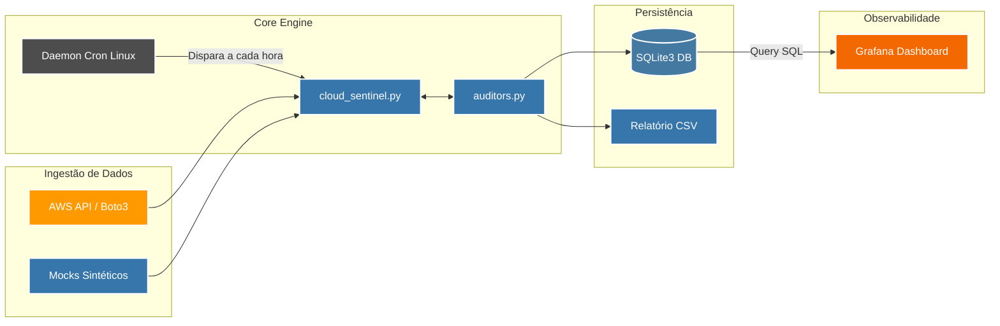
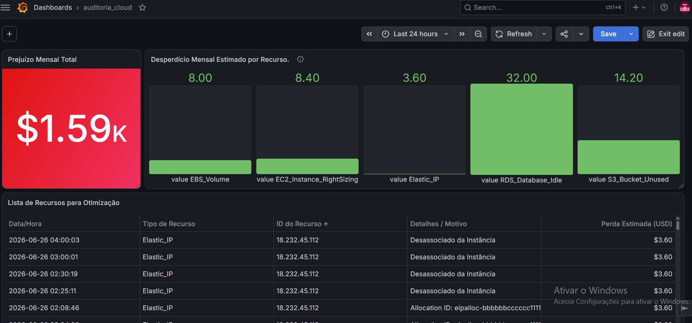
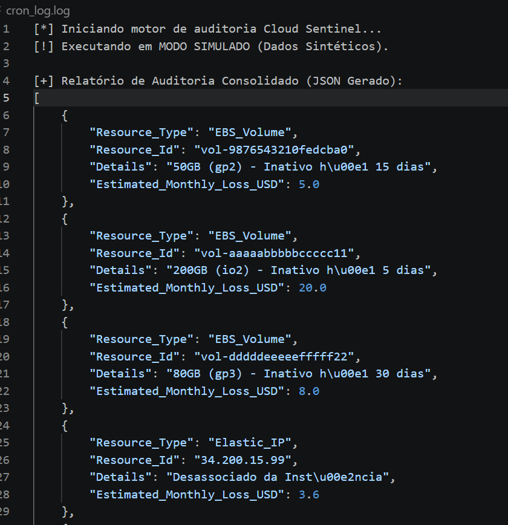

# 🛡️ Cloud Sentinel

Auditoria automatizada de FinOps para ambientes AWS. Identifica recursos ociosos, calcula o custo gerado por eles e estrutura os resultados em relatórios consultáveis.

## O problema

Recursos provisionados na AWS e esquecidos continuam gerando custo mesmo sem entregar valor. Um volume EBS sobrevive à instância que o usava; um Elastic IP fica alocado sem nunca ser associado a nada. Isoladamente, cada um parece irrelevante — acumulados ao longo de meses, sem visibilidade, é o que causa faturas inesperadamente altas.

O **Cloud Sentinel** automatiza essa detecção: varre os recursos, identifica os que estão ociosos, estima o custo desperdiçado e grava o resultado para consulta.

## Arquitetura

Visão completa do projeto, incluindo as etapas planejadas (Cron, integração AWS real e dashboard Grafana). O que está em produção hoje é detalhado na seção [Estado atual](#estado-atual).



O sistema é dividido em três responsabilidades, cada uma isolada em seu próprio módulo:

**`mocks.py`** gera dados sintéticos no formato exato das respostas reais da AWS (`describe_volumes`, `describe_addresses`). Isso permite testar e demonstrar todo o motor de auditoria sem depender de uma conta AWS ativa, sem custo e sem risco.

**`cloud_sentinel.py`** é o ponto de entrada. Recebe os dados, trata exceções (credenciais inválidas, permissões insuficientes) e coordena a chamada às regras de auditoria. Não contém lógica de negócio só orquestra.

**`auditors.py`** contém a lógica de negócio: identifica quais recursos estão ociosos, calcula há quanto tempo e quanto isso custou, e grava o resultado em CSV e/ou banco de dados, conforme a configuração.

**Nota de Design**: Essa separação existe por um motivo prático: trocar a fonte de dados (de mocks.py para uma chamada real via Boto3) não exige tocar em auditors.py. A lógica de auditoria é agnóstica à origem dos dados ela só espera receber a estrutura correta.

## Estrutura do repositório

```
cloud-sentinel/
├── img/                # Evidências e capturas de tela da plataforma rodando
├── auditors.py         # Regras de FinOps por recurso e conectores de saída (DB/CSV)
├── cloud_sentinel.py   # Orquestrador principal e tratamento de exceções do motor
├── mocks.py            # Fábrica de dados sintéticos para simulações de alta carga
├── .gitignore          # Bloqueia logs, bancos .db e chaves de credenciais
└── README.md           # Este documento
```

## Estado atual

| Componente | Status | Nota de Engenharia |
| :--- | :--- | :--- |
| Motor de auditoria (`auditors.py`) | 🟩 Concluído | Regras de FinOps validadas para alta volumetria. |
| Fábrica de Simulação (`mocks.py`) | 🟩 Concluído | Geração de alta demanda sintética (Custo Zero). |
| Persistência (SQLite / CSV) | 🟩 Concluído | Histórico temporal alimentado de hora em hora. |
| Automação (`Cron`) | 🟩 Concluído | Agendamento Linux ativo e gerando logs locais. |
| Dashboard `Grafana` | 🟩 Concluído | Operando com 3 painéis (Valores, Déficit e Serviços). |
| Integração AWS Real (`boto3`) | 🟨 Desacoplada | Estrutura pronta; mantida em sandbox por política de custos. |

## Visualização e Painéis (Grafana)

A dashboard do Grafana consome diretamente a série temporal persistida no SQLite de hora em hora pelo Cron. O ambiente está dividido em três visões estratégicas:

Prejuízo Mensal Total (Stat Panel): Métrica acumulada do impacto financeiro do desperdício de infraestrutura.

Desperdício Mensal Estimado por Recurso (Bar Gauge): Visão analítica de perdas individuais categorizadas por tipo de serviço AWS.

Lista de Recursos para Otimização (Table Panel): Visão operacional para o time de engenharia contendo a estampa de tempo, tipo de recurso, ID exato na nuvem e o motivo detalhado da ociosidade.


**Queries Analíticas Utilizadas no Ecossistema**

*Mapeamento de Tendência e Séries Temporais:*

SELECT 
    CAST(strftime('%s', timestamp) AS INTEGER) AS time,
    estimated_loss AS value,
    resource_type AS metric
FROM auditoria_custos
ORDER BY time ASC;

*Painel Operacional de Recursos Ativos:*

SELECT 
    timestamp AS "Data/Hora",
    resource_type AS "Tipo de Recurso",
    resource_id AS "ID do Recurso",
    details AS "Detalhes / Motivo",
    estimated_loss AS "Perda Estimada (USD)"
FROM auditoria_custos
ORDER BY timestamp DESC;


## Como funciona, na prática

A execução atual roda inteiramente sobre dados sintéticos. Essa decisão foi deliberada: validar a lógica de auditoria por completo antes de conectar a uma conta AWS real, eliminando a chance de erro de configuração custar dinheiro de verdade durante o desenvolvimento.

Para garantir a autonomia do motor sem intervenção manual, a execução foi automatizada em background utilizando o agendador nativo do Linux.




O fluxo:

1. `cloud_sentinel.py` é executado e solicita os dados de infraestrutura.
2. `mocks.py` entrega esses dados no mesmo formato que a API real da AWS retornaria uma lista de volumes EBS e Elastic IPs, alguns ociosos, alguns em uso.
3. `auditors.py` recebe essa lista e aplica as regras: um volume sem instância associada é ocioso; um IP sem associação é ocioso. Para cada um, calcula o tempo parado e o custo estimado.
4. O resultado é persistido em CSV, em banco de dados, ou ambos, dependendo da configuração ativa no momento da execução.

## Segurança

O projeto segue o princípio do menor privilégio desde a concepção. O usuário/role que futuramente acessará a AWS real terá apenas permissões de leitura sobre os recursos auditados, nunca permissão de escrita ou exclusão. Não há motivo para uma ferramenta de auditoria ter poder de modificar a infraestrutura que ela só deveria observar.

O `.gitignore` garante que nada sensível chegue ao repositório: bancos `.db` locais, logs de execução, ambientes virtuais e qualquer arquivo de credencial.

## Tecnologias

Python 3.x, com Boto3 como SDK de integração com a AWS. Persistência em CSV e SQLite. Versionamento seguindo o padrão de Conventional Commits.

## Executando localmente

```bash
git clone https://github.com/DarleiVN/cloud-sentinel.git
cd cloud-sentinel

python3 -m venv venv
source venv/bin/activate

pip install -r requirements.txt

python cloud_sentinel.py
```

## Autor

**Darlei Vieira** — [github.com/DarleiVN](https://github.com/DarleiVN)